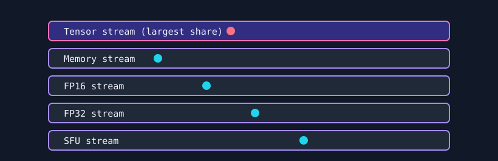

# Omni Virus

`omni_virus` is a mixed-workload furnace. It launches concurrent tensor, memory, FP16, FP32, and SFU streams to stress multiple execution and memory paths at the same time.



## What It Stresses

| Area | Stress mechanism |
| :--- | :--- |
| Matrix cores | FP16 WMMA, `mma_acc` independent accumulators per warp, operands restaged from shared memory. |
| Memory path | Coalesced non-temporal stores over a window that advances each launch, complementary patterns on adjacent words. |
| FP16 path | Half2 quadratic map, eight independent chains per thread. |
| FP32 path | FP32 quadratic map, eight independent chains per thread. |
| SFU path | Fast transcendental intrinsics, four independent chains per thread. |
| Concurrency | Five streams run together to create combined pressure. |

## Reaching TDP

Three things decide whether this test lands near the card's power limit or near half of it.

**The matrix cores have to be running.** On Hopper and Blackwell the tensor pipes are worth more than an order of magnitude more FLOPS than the vector pipes and they draw accordingly. A test built only from FMA, transcendental and store traffic cannot reach the power limit. The tensor stream takes the largest share of the grid; `mma_pct` controls it.

**The datapaths have to toggle.** Dynamic power is switching activity. A recurrence that saturates to infinity, or a WMMA loop whose operand fragments never change, keeps the pipes issuing while the same values are recomputed and the die stays cool. The compute streams run a chaotic map that stays bounded (`x <- x*x + c` with `c` in `[-1.435, -1.4]` cannot leave `|x| <= 1.435`), and the tensor stream rotates through hashed operand tiles.

**The streams have to finish together.** Each stream owns a fixed slice of the grid, so a stream that finishes early leaves its SMs idle until the next device sync. With fixed loop counts the memory stream finished in milliseconds while the tensor stream took seconds. `launch_ms` calibrates each stream's loop count at startup so one launch of each takes about the same time.

## Tuning

`mma_acc` is how many `mma_sync` results are in flight per warp: too few and each MMA waits on the previous accumulator, too many and registers limit residency. 16 is the maximum, since 32 accumulator fragments need 256 registers per thread. `mma_pct` is the tensor stream's share of the grid; the other streams add datapaths a pure GEMM leaves cold, which helps while there is power headroom.

Measured on 8x B200, 45 s per point, steady-state board power:

| `mma_pct` | `mma_acc` | W/GPU | peak C | TFLOPS (node) |
| ---: | ---: | ---: | ---: | ---: |
| 50 | 4 | 538 | 39 | 1542 |
| 50 | 16 | 626 | 42 | 2937 |
| 75 | 8 | 657 | 42 | 3597 |
| 90 | 8 | 677 | 42 | 4895 |
| **90** | **16** | **696** | **43** | **5763** |

This sweep predates the memory-window and staging changes; a later run of the defaults measured 611 W per GPU.

`mma_groups` and `mma_reuse` set operand staging: reloads from shared memory per iteration, and MMA passes per reload (default 4 MMA per load). Raising `mma_reuse` measured worse: node power fell from 5568 W to 5500 W and 43 C to 40 C at reuse 8. The shared-memory loads draw power themselves, so removing them removes power.

To see which pipe limits the test, run with `--profile` and compare `sm__inst_executed_pipe_tensor.sum` with `sm__inst_executed_pipe_lsu.sum`.

To sweep the settings, build once through the runner so the CUDA toolkit is found, then drive the binary on all GPUs at once (one GPU does not reach node-level power or neighbour heating):

```bash
uv run pantheon --test omni_virus --duration 5 --mem 10   # build only

nvidia-smi --query-gpu=index,power.draw,temperature.gpu --format=csv -l 2 > sweep.csv &
smi=$!
for pct in 50 75 90 100; do
  for acc in 4 8 16; do
    pids=()
    for g in $(seq 0 7); do
      ./build/omni_virus $g 60 90 --mma_pct $pct --mma_acc $acc >/dev/null &
      pids+=($!)
    done
    wait "${pids[@]}"    # a bare `wait` would also wait for nvidia-smi
  done
done
kill $smi
```

`wmma::mma_sync` uses the synchronous MMA instructions and reached about 32% of peak on a B200 (720 of about 2250 dense FP16 TFLOPS). The asynchronous path (WGMMA on Hopper, the Blackwell tensor-core instructions) is not reachable through WMMA.

## How It Works

1. The test allocates a memory buffer and per-stream compute sink buffers.
2. Each stream's loop count is calibrated so one launch takes about `launch_ms`.
3. Five independent streams launch tensor, memory, FP16, FP32, and SFU work.
4. With `--verify`, every stream is compared against a golden output.

## Command Examples

```bash
pantheon --test omni_virus --gpu 0 --duration 30 --mem 90
```

Push more of the grid onto the matrix cores, and take longer launches:

```bash
build/omni_virus 0 60 90 --mma_pct 75 --launch_ms 400
```

## Runtime Parameters

| Parameter | Default | Effect |
| :--- | ---: | :--- |
| `block_size` | `256` | Threads per block. Rounded up to a whole number of warps. |
| `grid_size` | `0` | Total blocks across all streams. `0` means auto-calculate. |
| `mma_pct` | `90` | Share of the grid given to the tensor stream, `0`-`100`. |
| `mma_acc` | `16` | Accumulator fragments per warp in the tensor stream: `2`, `4`, `8` or `16`. |
| `mma_groups` | `4` | Operand reloads per iteration. |
| `mma_reuse` | `1` | MMA passes per operand reload. |
| `launch_ms` | `200` | Per-launch wall-time target used to calibrate loop counts. `0` disables calibration and falls back to `kernel_loops`. |
| `kernel_loops` | `5000` | Manual loop scale, used only when `launch_ms` is `0`. |
| `warmup_iters` | `5` | Warmup launches before telemetry. |
| `sync_mode` | `2` | `0=Spin`, `1=Yield`, `2=Block`. |
| `init_pattern` | `0` | Memory initialization: `0=Zeroes`, `1=Ones`. Also flips the tensor operand seed. |

On a part without matrix cores, or an AMD build without rocWMMA headers, the tensor stream is dropped and the grid is split across the remaining four.

The memory stream writes a window that advances by its own length each launch instead of sweeping the whole allocation. Sweeping tied a launch's duration to both the allocation size and the stream's block count: at `mma_pct 100` one memory block had to cover about 160 GB while the other streams waited at the device sync, which cost 60% of board power. Verification accepts either pattern or the initial value, so it is unaffected.

## Source

The implementation lives in [`omni_virus.cpp`](./omni_virus.cpp).
